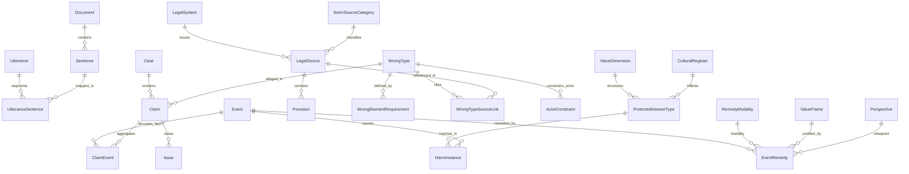

# SensibLaw Ontology & Database Design

This document describes the authoritative SensibLaw ontology as a **Layer‑0 text substrate plus six legal layers (L1–L6)**. The previous three-layer outline has been superseded; the latest structure aligns with the multi-layer references in `docs/external_ontologies.md` and the finance/utterance ER diagram in `docs/ontology_er.md`. Schema snapshots (e.g., `schemas/event.schema.yaml`) remain the source of truth for serialized payloads.

## Layer Summary

| Layer | Scope | Representative Entities | Primary/Foreign Keys |
| --- | --- | --- | --- |
| **Layer 0 — Text & Provenance** | Raw text containers and utterance mapping used by every other layer. | `Document`, `Sentence`, `Utterance`, `UtteranceSentence` | `Document.id`, `Sentence.id → document_id`, `Utterance.id → document_id`, `UtteranceSentence.utterance_id`, `UtteranceSentence.sentence_id` |
| **Layer 1 — Events & Actors** | Life/legal events and the actors who participate in or trigger them. | `Event`, `Actor`, `EventFinanceLink`, `FinanceProvenance` | `Event.id`, `Actor.id`, `EventFinanceLink.event_id ↔ transaction_id`, `FinanceProvenance.transaction_id ↔ sentence_id` |
| **Layer 2 — Claims & Cases** | Case/claim scaffolding that organises allegations, issues, and fact sets. | `Case`, `Claim`, `Issue`, `ClaimEvent` | `Case.id`, `Claim.id → case_id`, `Issue.id → claim_id`, `ClaimEvent.claim_id ↔ event_id` |
| **Layer 3 — Norm Sources & Provisions** | Jurisdictions, legal sources, and citations that authorise duties. | `LegalSystem`, `NormSourceCategory`, `LegalSource`, `Provision` | `LegalSystem.id`, `NormSourceCategory.id`, `LegalSource.id → legal_system_id, norm_source_category_id`, `Provision.id → legal_source_id` |
| **Layer 4 — Wrong Types & Duties** | Abstract wrongs/offences and the doctrinal elements that define them. | `WrongType`, `WrongTypeSourceLink`, `WrongElementRequirement`, `MentalState`, `ActorConstraint` | `WrongType.id → legal_system_id, norm_source_category_id`, `WrongTypeSourceLink.wrong_type_id ↔ legal_source_id`, `WrongElementRequirement.id → wrong_type_id`, `ActorConstraint.id → wrong_type_id` |
| **Layer 5 — Protected Interests & Harms** | What the law protects and how events damage those interests. | `ValueDimension`, `CulturalRegister`, `ProtectedInterestType`, `HarmInstance` | `ValueDimension.id`, `CulturalRegister.id`, `ProtectedInterestType.id → value_dimension_id, cultural_register_id?`, `HarmInstance.id → event_id, protected_interest_type_id` |
| **Layer 6 — Value Frames & Remedies** | Moral frames, community perspectives, and outcome modalities. | `ValueFrame`, `RemedyModality`, `EventRemedy`, `Perspective` | `ValueFrame.id`, `RemedyModality.id`, `EventRemedy.id → event_id, remedy_modality_id`, `Perspective.id → value_frame_id` |

## Text Substrate (Layer 0)

Layer 0 holds the textual backbone used for provenance and narrative context. The ER diagram in `docs/ontology_er.md` models the relationships among `Document`, `Sentence`, `Utterance`, and their segment mappings.

- **Document**: canonical container for transcripts, provisions, notes, or reasons (`Document.id`, `doc_type`, `text_block_id`).
- **Sentence**: sentence-level slices of documents (`Sentence.id`, `document_id`, `sentence_index`).
- **Utterance** and **UtteranceSentence**: diarised speech segments and the ordered mapping of sentences back to the originating utterance (`utterance_id`, `sentence_id`, `seq_index`).

## Events & Actors (Layer 1)

Events anchor everything downstream. Actors supply the participants and can be enriched with external references (e.g., Wikidata IDs) without altering normative reasoning.

- **Event**: life/legal/system events with time bounds (`Event.id`, `kind`, `valid_from`, `valid_to`).
- **Actor**: people, organisations, state entities, or recognised legal persons (`Actor.id`, `kind`, `label`).
- **EventFinanceLink**: ties events to transactional evidence (`event_id`, `transaction_id`, `link_kind`, `confidence`).
- **FinanceProvenance**: traces sentences that explain a transaction (`transaction_id`, `sentence_id`, `note`).

## Claims & Cases (Layer 2)

Cases collect claims, and claims link facts to issues that will later be evaluated against wrong types.

- **Case**: matter-level container with jurisdiction and party metadata (`Case.id`).
- **Claim**: asserted cause of action or defence within a case (`Claim.id`, `case_id`, `claim_kind`).
- **Issue**: contested questions or elements tied to a claim (`Issue.id`, `claim_id`, `issue_kind`).
- **ClaimEvent**: join table mapping events into the claim fact pattern (`claim_id`, `event_id`, optional `role` to distinguish conduct vs. context).

## Norm Sources & Provisions (Layer 3)

Layer 3 grounds the system in authoritative sources across jurisdictions and traditions.

- **LegalSystem**: jurisdiction or tradition identifiers (e.g., `AU.COMMON`, `NZ.TIKANGA`) with metadata for community, tradition, and source form.
- **NormSourceCategory**: enumerates the authority type (`STATUTE`, `CASE`, `TREATY`, `CUSTOM`, `RELIGIOUS_TEXT`, `COMMUNITY_RULE`).
- **LegalSource**: specific source documents (`id`, `legal_system_id`, `norm_source_category_id`, citation metadata).
- **Provision**: clause-level anchors inside a `LegalSource` (`id`, `legal_source_id`, structure for section/paragraph numbering).

## Wrong Types & Duties (Layer 4)

This layer expresses abstract wrongs or duties and the doctrinal structure that shapes them.

- **WrongType**: actionable wrong/offence scoped to a `LegalSystem` and tagged with its primary `NormSourceCategory`.
- **WrongTypeSourceLink**: many-to-many mapping between `WrongType` and `LegalSource` with relation types such as `creates`, `defines`, `modifies`, or `leading_case`.
- **WrongElementRequirement**: element-level requirements (e.g., duty, breach, causation, defences) linked to a `WrongType` and optionally to `Issue` records for traceability.
- **ActorConstraint** and **MentalState**: constrain which actors can commit or be subject to the wrong and the culpability standard required (strict, negligence, recklessness, intent).

## Protected Interests & Harms (Layer 5)

Layer 5 identifies what the wrong protects and how events harm those interests.

- **ValueDimension**: faceted taxonomy combining `family` (e.g., integrity, status, control) and `aspect` (body, reputation, information, territory).
- **CulturalRegister**: optional cultural inflections of a value (e.g., `mana`, `face`, `izzat`).
- **ProtectedInterestType**: composed interest definition referencing a `ValueDimension` and, where relevant, a `CulturalRegister`.
- **HarmInstance**: event-level assertion that an interest was harmed (`event_id`, `protected_interest_type_id`, severity/extent metadata). Often paired with `ClaimEvent` to show which facts satisfy which protected interests.

## Value Frames & Remedies (Layer 6)

The top layer captures moral perspectives and the forms of redress associated with an event or claim.

- **ValueFrame**: expresses justificatory frames (e.g., `gender_equality`, `tikanga_balance`, `child_rights`, `ecological_stewardship`).
- **Perspective**: optional qualifier that records whose viewpoint the frame reflects (community, state, victim, accused).
- **RemedyModality**: enumerates remedy families (`MONETARY`, `LIBERTY_RESTRICTION`, `STATUS_CHANGE`, `SYMBOLIC`, `RESTORATIVE_RITUAL`, `STRUCTURAL`).
- **EventRemedy**: joins events (or claims) to proposed or ordered remedies (`event_id`, `remedy_modality_id`, amount/terms fields) and tags them with the applicable `ValueFrame`/`Perspective`.

## Relationships and Cross-Layer Flow

## Authoritative Artifacts

- **ER Diagram**: `docs/ontology_er.md` (Mermaid `erDiagram` for text, finance, and provenance entities).
- **Event Schema**: `schemas/event.schema.yaml` (JSON schema used for serialized event payloads).
- **Keyword Ontology (legacy)**: `docs/ontology.md` retains backward-compatible tagging guidance, but this document supersedes its three-layer framing.
