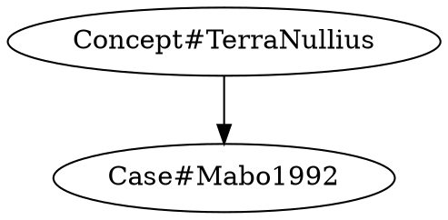

# SensibLaw 
## What is SensibLaw?

SensibLaw is an open legal knowledge-graph and reasoning engine.

At a high level:

- It ingests **legal sources** (cases, statutes, treaties, tikanga/custom) and **stories** (facts, timelines, receipts).
- It extracts **structured rules and principles** (“who owes what duty to whom, in which conditions”).
- It links both sources and stories into a **canonical graph** of:

  - Normative Systems & Sources (who sets rules)
  - Wrong Types & Duties (what the rules require / forbid)
  - Protected Interests & Harms (what is being protected, and how it goes wrong)
  - Value Frames & Remedies (how different systems justify and respond to wrongs)

If DBpedia and Wikitology treated Wikipedia as a global ontology for the Web,
SensibLaw treats legal corpora as a global ontology for **law and lived experience**.

## Development quickstart

```bash
pip install -e .[dev,test]
ruff format
ruff check --fix
mypy .
pytest --maxfail=1 -q
```

Useful entry points:

- CLI: `python -m sensiblaw.cli --help`
- Streamlit dashboard: `streamlit run streamlit_app.py`

## Project layout

- `src/` houses Python orchestration (`sensiblaw`, `sensiblaw_streamlit`, `fastapi`, `pydantic`).
- `scripts/` contains shared utilities and helpers.
- `sensiblaw/` includes CLI-ready entry points.
- `sensiblaw_streamlit/` and `ui/` contain UI assets and experimental dashboards.
- `data/` and `examples/` host legal corpora and fixtures.
- `tests/` mirrors package paths, with fixtures under `tests/fixtures/` and seeded payloads under `tests/templates/`.
- `docs/` tracks design notes, automation walkthroughs, and deep dives.

## Key functions, processes, and APIs (where they live)

- Data model backbone: `src/models/document.py` and `src/models/provision.py` define the `Document`, `Provision`, rule atoms, and metadata structures consumed across ingest, storage, and UI layers.
- PDF ingest pipeline: `iter_process_pdf`/`process_pdf` in `src/pdf_ingest.py` drive text extraction → TOC parsing → rule extraction → optional `VersionedStore.add_revision` and JSON output (`save_document`).
- Rule parsing & logic tree: `extract_rules` in `src/rules/extractor.py` finds modalities/faults/exceptions; `logic_tree.build` in `src/logic_tree.py` turns the token stream from `src/pipeline/__init__.py` / `src/pipeline/tokens.py` into deterministic clause trees.
- Concepts & glossary links: `ConceptMatcher.match`/`MATCHER` in `src/concepts/matcher.py` power trigger-based hits; curated definitions sit in `src/glossary/service.py:lookup`, with deduped linking via `GlossaryLinker` in `src/glossary/linker.py` and the ingest-time registry in `src/pdf_ingest.py:GlossaryRegistry`.
- Graph & inference: core node/edge types live in `src/graph/models.py`; ingestion helpers in `src/graph/ingest.py` map `Document` payloads to graphs; PyKEEN training and ranking helpers (`build_prediction_set`, `train_*`, `rank_predictions`) are in `src/graph/inference.py`.
- Storage & receipts: `VersionedStore` in `src/storage/versioned_store.py` handles versioned document persistence/validation; the lighter CRUD store is `src/storage/core.py`; provenance receipts are built/checked in `src/receipts/build.py` and `src/receipts/verify.py`.
- APIs: FastAPI routes for graph/test endpoints and provision atoms live in `src/api/routes.py`; the packaged server that mounts them (plus the corrections ledger UI) is `src/server/ledger_api.py`; demo story/rule endpoints are in `sensiblaw/api/routes.py`.
- CLIs: the main command definitions are in `cli/__main__.py` (invoked via `python -m sensiblaw.cli` through the shim in `src/cli.py`); receipts-specific commands are under `cli/receipts.py`.
- Streamlit console: `sensiblaw_streamlit/app.py` wires the tabs, with tab renderers in `sensiblaw_streamlit/tabs/` (`documents.py`, `text_concepts.py`, `knowledge_graph.py`, `case_comparison.py`, `utilities.py`).


## Conceptual Architecture (TiRC + SensibLaw)

SensibLaw is designed to sit tightly alongside TiRCorder (TiRC), our
"life’s evidence" timeline. Together they use a shared core schema:

1. **World & Artefacts (TiRC / shared core)**
   - `Event` – something happened (argument, transfer, hearing, email, etc.)
   - `Actor` – people, organisations, communities, ecosystems
   - `EvidenceItem` – PDFs, statements, screenshots, logs…

2. **Narrative & Claims (TiRC)**
   - Stories, perspectives, and claims about events (“this was economic abuse”, “this night broke me”).

3. **Legal Episodes / Cases (SensibLaw)**
   - Matters, issues, and causes of action in specific systems (FCFCOA, tikanga, tribal courts, etc.).

4. **Normative Systems & Sources**
   - Legal systems, statutes, regulations, cases, tikanga statements, religious norms and their provisions.

5. **Wrong Types, Duties, Interests & Harms**
   - WrongType (negligence, economic abuse, mana harm, defamation, etc.)
   - ProtectedInterest (physical integrity, financial security, mana, queer identity, ecological integrity…)
   - HarmInstance (how a particular event harmed a particular interest).

6. **Value Frames & Remedies**
   - ValueFrame (human rights, tikanga balance, gender equality, religious modesty, public order, etc.)
   - Remedy/Response, including:

     - `modality` – MONETARY, LIBERTY, STATUS, BODILY, TERRITORIAL, SYMBOLIC, STRUCTURAL
     - `purpose` – REPARATION, PUNISHMENT, RESTORATION, TRANSFORMATION, DETERRENCE

The NLP and graph pipelines that the README currently describes (spaCy adapter, logic tree,
graph subgraph, tests run, distinguish, query treatment…) all operate **inside this layered model**.


## External Knowledge & Linked Legal Data

SensibLaw takes a Wikitology/DBpedia-inspired approach to legal data:

- Every **case, provision, statute, and concept** gets a stable identifier.
- The graph is exportable as JSON today and is designed to support RDF/LOD-style projections later.
- NLP pipelines perform **legal entity linking** (mention → case / provision / concept) and **slot filling**
  (factors, harms, duties, wrong types, remedies) in the same spirit as TAC KBP.

Over time, the goal is for SensibLaw to act as a **canonical hub** that other tools can link to:

- case law APIs and public repositories (AustLII, Jade, court feeds…)
- TiRCorder event timelines (life events, receipts, narratives)
- domain-specific legal datasets (environment, family law, indigenous/tikanga sources, human rights)

In other words: for law, SensibLaw aims to be what DBpedia/Wikitology are for Wikipedia –
a structured, linked, machine-readable backbone.


## Most of our available docs:

|  |  |  |  |
| :--- | :--- | :--- | :--- |
| [Analytical Layers](docs/analytical_layers.md) | [API](docs/api.md) | [Automation Intelligence](docs/automation_intelligence.md) | [CI Acceptance](docs/ci_acceptance.md) |
| [CLI Examples](docs/cli_examples.md) | [Corpus Setup](docs/corpus_setup.md) | [Corrections UI](docs/corrections_ui.md) | [End to End](docs/end_to_end.md) |
| [Fuzzing](docs/fuzzing.md) | [Goldset Harness](docs/goldset_harness.md) | [Graph](docs/graph.md) | [Ingestion](docs/ingestion.md) |
| [Human Tools Integration](docs/human_tools_integration.md) | [Multi-Modal Doctrine](docs/multimodal_system_doctrine.md) | [Panopticon Refusal](docs/panopticon_refusal.md) | [User Stories](docs/user_stories.md) |
| [Parity View](docs/parity_view.md) | [Lexeme Layer](docs/lexeme_layer.md) | [Media Ethics UI](docs/media_ethics_ui.md) |  |
| [Policy](docs/policy.md) | [Reading Fatigue Killers](docs/reading_fatigue_killers.md) | [Roadmap](docs/roadmaps/roadmap.md) | [DB Roadmap](docs/roadmaps/DB_ROADMAP.md) |
| [Versioning](docs/versioning.md) | [Research Paper](PAPER.md) | [Database Design Document](DATABASE.md) | [Schema](docs/schema.md) |
| [Todo](todo.md) | [streamline - data visualisation](docs/roadmaps/TIMELINE_STREAM_VIZ_ROADMAP.md)  | [Ontology ER working dog](docs/ontology_er.md) | [Agents](AGENTS.md) |
| [ITIR Integration Roadmap](docs/ITIR.md) |    | [External Ontologies](external_ontologies.md) | [Wikidata Queries](wikidata_queries.md) |


[](https://github.com/SensibLaw/SensibLaw/actions/workflows/ci.yml)
[](https://github.com/OWNER/SensibLaw/actions/workflows/ci.yml)


Here’s the “data / ontology / topology” spine of all that, stripped of rhetoric.

---

## 1. What’s the *thing* being classified?

**Core unit at the ontology level**

* `WrongType` = *a named actionable wrong in some legal system*

  * e.g. AU negligence, AU defamation, “harm to mana”, tikanga muru, CRC-based wrongful child removal, EU GDPR data-breach claim, US intrusion upon seclusion, etc.

**Core unit at the data / timeline level**

* `Event` = *something that actually happened in the world*, possibly with:

  * `Claim` (“that was economic abuse”)
  * `CaseIssue` (how the legal system frames it)
  * `WrongTypeInstance` (how SensibLaw classifies it)

Everything else (cases, principles, statutes, indigenous norms, human-rights instruments) is “context” for how an `Event` gets mapped to one or more `WrongType`s in a particular legal system. 

---

## 2. Layered world model (ontology as layers)

The unified stack is:

0. **World & artefacts (TiRC + shared core)**

   * `Event`, `Actor`, `EvidenceItem`
1. **Narrative & claims (TiRC)**

   * `StorySegment`, perspectives, subjective tags (“this night broke me”)
2. **Legal episodes / cases (joint)**

   * `Case`, `CaseIssue`, `CaseEvent`
3. **Normative systems & sources (SensibLaw)**

   * `LegalSystem`, `NormSource` (statute, case, tikanga statement, treaty, religious text), `Provision`, `Principle`
4. **Wrongs, duties, interests, harms (SensibLaw)**

   * `WrongType`, `ProtectedInterestType`, `HarmInstance`, `Duty/Power/Immunity`
5. **Value frames & remedies (SensibLaw)**

   * `ValueFrame` (human rights, tikanga balance, child-rights, religious modesty, etc.)
   * `Remedy` (with `modality` + `purpose`)

TiRC “owns” 0–1, SensibLaw “owns” 3–5; **layer 2 (Case)** is shared territory.

---

## 3. Shared data core vs product-specific tables

### 3.1 Shared core (TiRC + SensibLaw)

These tables are product-agnostic and form the **common backbone**:

* `core_actor`
* `core_event`
* `core_evidence_item`
* `core_event_actor` (who did what in each event)
* `core_relation` (generic relationships: spouse-of, parent-of, guardian-of, etc.)

Both products **only ever hang off these** for real-world facts.

### 3.2 TiRC-specific

* `tirc_story_segment`, `tirc_session`, `tirc_tag`, `tirc_event_annotation`, `tirc_receipt_bundle`, etc.
  All **FK into** `core_event`, `core_actor`, `core_evidence_item`.

### 3.3 SensibLaw-specific

* System / norm layer:

  * `sl_legal_system`, `sl_norm_source`, `sl_provision`, `sl_principle`
* Wrong/interest/value layer:

  * `sl_wrong_type`, `sl_protected_interest_type`, `sl_value_frame`, `sl_remedy`
* Application layer:

  * `sl_case`, `sl_case_issue`, `sl_wrong_type_instance`, `sl_harm_instance`

These always FK **down** into the core (`core_event`, `core_actor`, `core_evidence_item`) and **up** into norms/values (`sl_norm_source`, `sl_wrong_type`, `sl_value_frame`, `sl_remedy`).

---

## 4. Ontology of `WrongType`: faceted, not a giant tree

The taxonomy of wrongs is *faceted* and normalised, not “one big hierarchy”.

### 4.1 Normative system & duty source

Normalised out of `WrongType`:

* `nation`
* `legal_system` (e.g. AU common law, Tikanga Māori, particular tribal code, CN Civil Code, IN constitutional)
* `norm_source_category` (common law, statute, constitution, human-rights treaty, indigenous custom, religious norm, social norm)

`WrongType` just FK’s into `legal_system` and `norm_source_category`.

### 4.2 Protected interests (more atomic)

Instead of a fat enum like `PHYSICAL_INTEGRITY | PROPERTY | ECONOMIC_INTEREST`, protected interests are decomposed into smaller dimensions:

* `interest_subject_kind` – who/what is protected:

  * INDIVIDUAL / GROUP / COMMUNITY / STATE / ENVIRONMENT / ANCESTORS / RIVER / TOTEM_SPECIES, etc.
* `interest_object_kind` – what aspect:

  * BODY / MIND / PROPERTY / DATA / REPUTATION / RELATIONSHIP / CULTURE / TERRITORY / ECOSYSTEM / LINEAGE…
* `interest_modality` – what *kind* of protection:

  * INTEGRITY, USE_AND_ENJOYMENT, CONTROL, PRIVACY, STATUS, HONOUR_MANA, DEVELOPMENT, NON_DOMINATION, etc.

Then:

* `protected_interest_type` = (subject_kind, object_kind, modality) tuple.
* A `WrongType` can link to one or many `protected_interest_type`s via `wrong_type_protected_interest`.

This lets “harm to mana”, “defamation”, “CRC child removal”, “GDPR data breach” all live in the same interest space without being flattened.

### 4.3 Actor / relationship pattern

Separate axis describing **who is in what relationship**:

* PRIVATE_V_PRIVATE
* STATE_V_PRIVATE
* INSTITUTION_V_VULNERABLE_GROUP
* KINSHIP_BASED
* COMMUNITY_V_MEMBER
* GUARDIAN_V_CHILD
* PERSON_V_ENVIRONMENT
  …stored in `wrong_type_actor_pattern`.

This is where Indigenous, child-rights and human-rights wrongs fit naturally (kinship duties, community vs member, state vs detainee, etc.).

### 4.4 Mental state

Kept small and reusable, but normalised:

* STRICT
* NEGLIGENCE
* RECKLESSNESS
* INTENTION
* MIXED_OR_TIERED

Linked via `wrong_type_mental_state` (or a typed column if you keep it single-valued).

### 4.5 Harm class (what actually happens)

Distinct from *protected interest* (the right), this axis describes the **consequence**:

* BODILY_INJURY, DEATH, PSYCHIATRIC_INJURY
* PURE_ECONOMIC_LOSS, PROPERTY_DAMAGE
* DIGNITARY_HARM (humiliation, honour/mana)
* CULTURAL_HARM (sacred sites, Country, whakapapa)
* ENVIRONMENTAL_HARM
* FAMILY_RELATIONAL_HARM (child removal, kinship interference)
* COMMUNITY_HARM (disharmony)
* DATA_SECURITY_HARM
* SPIRITUAL_HARM (taboo breaches, sorcery injuries)

Saved in `wrong_type_harm_class`.

### 4.6 Remedy / forum profile

Not “racist special case” but a neutral way of capturing **how** different systems repair harm:

* DAMAGES_MONEY
* INJUNCTION / DECLARATION
* RESTORATIVE_RITUAL (muru, apology ceremony, payback rites)
* COLLECTIVE_COMPENSATION (to whānau / clan / community)
* PEACEMAKING_PROCESS (tribal court / Indigenous dispute process)
* HUMAN_RIGHTS_TRIBUNAL
* INTERNATIONAL_COURT_OR_COMMISSION

This makes “trespass to land”, “sacred-site desecration”, and “ECHR Article 8 privacy breach” comparable at the ontology level without erasing their remedy culture; stored in `wrong_type_remedy_profile`.

### 4.7 Cross-system topology for wrong types

A small `wrong_type_relation` table captures analogies and hierarchy:

* `functional_analogue`
* `broader_than` / `narrower_than`
* `inspired_by`

e.g.:

* Tikanga `harm_to_mana` is `functional_analogue` of AU defamation + intentional emotional harm.
* Indigenous sacred-site desecration is `functional_analogue` of nuisance/trespass but with primary `CULTURAL_SPIRITUAL` interest and `RESTORATIVE_RITUAL` remedies.

---

## 5. Overall topology: how the graph hangs together

At the graph level, the topology looks like:

* `Event` —(has_evidence)→ `EvidenceItem`
* `Event` —(described_in)→ `StorySegment`
* `Event` —(involves)→ `Actor` (via `core_event_actor`)
* `Case` —(concerns)→ many `Event`s
* `CaseIssue` —(frames)→ subset of `Event`s
* `WrongTypeInstance` —(applies_to)→ `Event` (or cluster)
* `WrongTypeInstance` —(instantiates)→ `WrongType`
* `ProtectedInterestType` —(protected_by)→ `WrongType`
* `HarmInstance` —(realises)→ `ProtectedInterestType` and attaches to `Event`
* `WrongType` —(authorised_by)→ `NormSource` / `Principle` in some `LegalSystem`
* `WrongType` —(evaluated_under)→ `ValueFrame`
* `Remedy` —(responds_to)→ `WrongTypeInstance` / `HarmInstance`

So the *same* `Event` can be simultaneously:

* A TiRC narrative moment (“this night broke me”),
* A tikanga `harm_to_mana`,
* A non-actionable “verbal abuse” in AU tort,
* A human-rights or child-rights violation in another system,
  all by attaching multiple `WrongTypeInstance`s to the same `core_event`.

---

## 6. Data-management implications

* **Single “core reality” store** for actors/events/evidence; TiRC and SensibLaw are just different projection layers.
* **Ontology tables** (legal systems, norm sources, protected interests, wrong types, harms, value frames, remedies) are:

  * heavily normalised,
  * cross-system,
  * versioned and receipt-tracked via SensibLaw’s existing VersionedStore.
* **Topology is explicit**: relationships are FKs/edges, not inferred magic; easy to:

  * export to JSON / RDF,
  * feed into graph DBs,
  * run cross-system comparisons (“what are all the wrong types that protect child development against state actors, regardless of jurisdiction?”).


Like coleslaw, it just makes sense.


## NLP Integration Snapshot

The upcoming spaCy integration is charted in a deliverables matrix that captures the
current regex-centric pipeline and the target state for a fully token-aware flow. For
the full roadmap, including phased milestones and definitions of done, see
[docs/roadmap.md](docs/roadmap.md).

| Category | **Current State ("As-is")** | **Target State ("To-be")** | **Key Deliverables** |
| --- | --- | --- | --- |
| **Tokenization** | Hand-rolled regex (`\w+`) and manual text splitting. No sentence boundaries, no offsets beyond character indexes. | Deterministic tokenization with sentence boundaries, offsets, and lemmatization from `spaCy` (or Stanza via adapter). | • `src/nlp/spacy_adapter.py` implementing `parse()` → returns `{sents: [{text, start, end, tokens: [{text, lemma, pos, dep, start, end}]}]}`<br>• Unit tests verifying token alignment vs original text (`tests/nlp/test_spacy_adapter.py`). |
| **POS & Lemmas** | None. `normalise()` only lowercases and applies glossary rewrites. | Each token enriched with `POS`, `morph`, and `lemma_` for downstream classification (actor/action/object inference). | • Extend adapter output to include `lemma_`, `pos_`, `morph`.<br>• Add `Token.set_extension("class_", default=None)` for logic tree tagging. |
| **Dependency Parsing** | None. Rule extractors rely on regex (`must`, `if`, `section \d+`). | Dependency tree available per sentence (`nsubj`, `obj`, `aux`, `mark`, `obl`, etc.) for clause role mapping. | • Use `spaCy` built-in parser or `spacy-stanza` (UD).<br>• Expose `get_dependencies()` helper returning role candidates.<br>• Test fixture: “A person must not sell spray paint.” → `nsubj=person`, `VERB=sell`, `obj=spray paint`. |
| **Sentence Segmentation** | Not explicit — one clause per doc or regex breaks on periods. | Automatic sentence boundary detection from spaCy pipeline. | • Enable `sents` iterator from `Doc`.<br>• Add `Sentence` object to data model (`src/models/sentence.py`). |
| **Named Entity Recognition (NER)** | None. Only concept IDs from Aho–Corasick triggers. | Reuse spaCy’s built-in NER (`PERSON`, `ORG`, `LAW`) + optional `EntityRuler` for legal-specific entities. | • `patterns/legal_patterns.jsonl` for Acts, Cases, Provisions.<br>• Integrate `entity_ruler` pipe; expose hits as `REFERENCE` spans. |
| **Rule-based Matchers** | Regex in `rules.py` finds modalities, conditions, and refs manually. | Replace manual regex with `Matcher` and `DependencyMatcher` patterns. | • `src/nlp/rules.py` defining matchers for `MODALITY`, `CONDITION`, `REFERENCE`, `PENALTY`.<br>• Unit tests verifying expected matches per pattern. |
| **Custom Attributes / Logic Tree Hooks** | N/A — logic tree built from scratch after regex tokens. | Every token/span carries `._.class_` = {ACTOR, ACTION, MODALITY,…}, ready for tree builder. | • `Token.set_extension("class_", default=None)`.<br>• Populate via matcher callbacks.<br>• Verify full coverage (no unlabeled non-junk tokens). |
| **Integration into pipeline** | `pipeline.normalise → match_concepts` only. No NLP pipe. | New `pipeline/tokens.py` module invoked between `normalise` and `logic_tree`. | • Update `pipeline/__init__.py`:<br>`tokens = spacy_adapter.parse(normalised_text)`.<br>• Pass token stream to `logic_tree.build(tokens)`. |
| **Fallback / Multilingual** | English-only regex. | Wrapper can swap Stanza/UD when language ≠ "en". | • Optional `SpacyNLP(lang="auto")` detects LID and selects model.<br>• Add `fastText` or Tika LID hook. |
| **Testing & Validation** | No automated linguistic tests. | Deterministic tokenization, POS, dep, and matcher coverage tests. | • `tests/nlp/test_tokens.py` (token counts, sentence segmentation).<br>• `tests/nlp/test_rules.py` (pattern hits).<br>• Golden expected JSON per input sample. |

## Upcoming platform work

We are formalising the next major SensibLaw milestones around provenance,
pipeline interoperability, and reasoning UX. The current sprint is focused on:

- **Text extraction stack** – ship a Docker Compose bundle wiring Apache Tika
  and OCRUSREX through a provenance sidecar, plus a `bin/extract_text` CLI and
  golden-path tests that prove deterministic receipts.
- **Gremlin-compatible pipeline** – document the node contract, publish a
  reusable Gremlin DAG template, and add a local runner + containerised nodes so
  the full pipeline can execute inside or outside Gremlin unchanged.
- **Standard node SDK** – provide shared schemas, a base runner, and
  conformance tests so every node emits uniform JSON, metrics, and receipts
  while honouring deterministic replays.
- **Deterministic logic tree** – evolve the current token and semantic matching
  flow into an explicit control-flow graph that captures entry points,
  transition rules, and "junk" filtering so every clause decision is
  reproducible and auditable.
- **Reasoning viewer** – deliver a Streamlit-only interface (with embed mode)
  that visualises proof trees, highlights pin-cites, and renders knowledge graph
  neighbourhoods for completed jobs.

Each strand bakes tool versioning and receipt storage into its outputs so we
can meet provenance, determinism, and adoption targets simultaneously. The
logic tree work, in particular, codifies the word-catching triggers described in
our current CLI so we can ship a formal specification and reference
implementation alongside the pipeline assets.

## Installation

Install the runtime dependencies for a quick setup:

```bash
pip install -r requirements.txt
```

Install the project along with the development and test dependencies:

```bash
pip install -e .[dev,test]
```

## Testing

Install the test extras and run the suite. The extras include
[Hypothesis](https://hypothesis.readthedocs.io/), which powers the
project's property-based tests:

```bash
pip install -e .[test]
pytest
```

## Streamlit console

SensibLaw now includes a Streamlit dashboard that mirrors the CLI workflows in an
interactive web interface. The runtime dependency is bundled with the project, so
installing the package in editable mode is sufficient:

```bash
pip install -e .
```

Launch the console from the repository root:

```bash
streamlit run streamlit_app.py
```

The console implementation lives in the `sensiblaw_streamlit/` package. The
`sensiblaw_streamlit.app:main` entrypoint wires together the shared helpers and
individual tab renderers, so importing and reusing the UI components in other
contexts is straightforward.

### What to try

- **Documents tab** – upload a PDF (or pick the bundled Mabo sample) to run
  `process_pdf`, persist the output via `VersionedStore`, and fetch historical
  snapshots by ID and effective date.
- **Text & Concepts** – paste or load example text to run `normalise`,
  `match_concepts`, `build_cloud`, `extract_rules`, and the sample FastAPI
  helpers for provision tagging and DOT exports.
- **Knowledge Graph** – seed the in-memory graph with demo cases, call
  `generate_subgraph`, `execute_tests`, `fetch_case_treatment`, and
  `fetch_provision_atoms`, and download the resulting payloads.
- **Case Comparison** – load the GLJ silhouette via `load_case_silhouette`,
  upload a story facts JSON payload, and review overlaps/missing factors from
  `compare_story_to_case`.
- **Utilities** – experiment with glossary lookups, frame compilation,
  receipts build/verify, `simhash`, FRL ingestion helpers, rule consistency
  checks, and harm scoring.

The console surfaces progress indicators for long-running tasks and includes
download buttons so you can inspect JSON payloads generated by each helper.

## Automation & Intelligence

The automation layer stitches together the rule extractor, ontology tagger, and
versioned store so negotiators can:

- Parse free-form statements to auto-populate concession weights.
- Simulate scenarios with slider-driven fairness and win/loss projections.
- Cross-check proposed trades against historical compromise corridors.

See [docs/automation_intelligence.md](docs/automation_intelligence.md) for the
full walkthrough of these automation capabilities.

## Reading-Fatigue Killers

Bundles annotated with issues, factors, and deadlines can now be piped through
the reading-focussed utilities in
[docs/reading_fatigue_killers.md](docs/reading_fatigue_killers.md):

- Generate a keyboard-first pin-cite navigator using
  ``build_pin_cite_navigator``.
- Collapse redundant paragraphs across drafts with ``DuplicateDetector``.
- Toggle a "focus lane" view via ``focus_lane`` to keep attention on live
  decision points.

The trio is tuned for the "50-page bundle to first decision in under ten
minutes" workflow and can be wired into bespoke UI layers or console scripts.

## Linting and type checks

Execute all linting and type-check hooks:

```bash
pre-commit run --all-files
```

Install the package in editable mode along with development dependencies to develop locally:

```bash
pip install -e .[dev,test]
pre-commit install
pre-commit run --all-files
```

## Development

Create and activate a virtual environment, then install the development
dependencies:

```bash
python -m venv .venv
source .venv/bin/activate
pip install -e .[dev,test]
```

Run the test suite and pre-commit hooks:

```bash
pytest
pre-commit run --all-files
```

Test fixtures are located in `tests/fixtures`, and reusable templates live in
`tests/templates`.


## CLI Commands

Graph rendering relies on the Graphviz toolchain. Install the system
package separately, for example:

```bash
sudo apt-get install graphviz  # Debian/Ubuntu
# or
brew install graphviz          # macOS
```

## CLI

### CLI Commands

#### Retrieve document revisions

Retrieve a document revision as it existed on a given date:

```bash
sensiblaw get --id 1 --as-at 2023-01-01
```

Fetch how later authorities have treated a given case:

```bash
sensiblaw query treatment --case case123
```

See [docs/versioning.md](docs/versioning.md) for details on the versioned
storage layer and available provenance metadata.

#### Ingest PDF documents

Extract provisions and atoms from a PDF while writing the structured
[`Document`](src/models/document.py) payload into the SQLite store:

```bash
sensiblaw pdf-fetch data/example.pdf --jurisdiction "NSW" --citation "Act 1994" \
  --db data/store.db
```

#### Build a brief prep pack for counsel

Compile the submission skeletons, coverage grid, counter-argument bank, and
bundle check into a single directory with a counsel-facing PDF:

```bash
sensiblaw brief pack --matter matter.json --out out/brief
```

The command writes `brief_pack.json`, `first_cut_brief.txt`, and the PDF inside
`out/brief`.

To reuse an existing document identifier when appending a new revision:

```bash
sensiblaw pdf-fetch data/amendment.pdf --jurisdiction "NSW" --citation "Act 1994" \
  --db data/store.db --doc-id 42
```

Both commands emit the parsed structure to stdout (and optionally `--output`)
so that downstream tooling can inspect the [`Provision`](src/models/provision.py)
hierarchy, while the `--db/--doc-id` options persist the same structure in the
versioned store.

## Development

Optionally install [pre-commit](https://pre-commit.com/) to run linters and
type checks before each commit:

```bash
pip install pre-commit
pre-commit install
```

The configured hooks will run `ruff`, `black --check`, and `mypy` over the
project's source code.

## CLI Commands

### Match Concepts

Identifies legal concepts in free text based on pattern triggers.

*Required files*: `triggers.json` containing concept patterns.

```bash
sensiblaw concepts match --patterns-file triggers.json --text "permanent stay"
```

Sample output:

```json
[
  "Concept#StayOfProceedings"
]
```

### Explore Graph Subgraphs

Generates a DOT-format subgraph around seed nodes within the knowledge graph.

*Required files*: pre-built graph data (e.g., ontology and case sources under `data/`).

```bash
sensiblaw graph subgraph --node Concept#TerraNullius --node Case#Mabo1992 --hops 2 --dot
```

Sample output:



### Run Story Tests

Executes scenario tests against a narrative story to verify expected outcomes.

*Required files*: `s4AA.json` containing test definitions and `story.json` with the scenario data.

```bash
sensiblaw tests run --tests-file s4AA.json --story-file story.json
```

Sample output:

```text
3 passed, 0 failed
```

## Development

Install development dependencies:

```bash
pip install -e .[dev,test]
```

Run tests:

```bash
pytest
```

Run lint and type checks:

```bash
pre-commit run --all-files
```

Run the SensibLaw tests against fixture data:

```bash
sensiblaw tests run tests/fixtures/glj_permanent_stay_story.json
```

## Data ingestion

The PDF ingestion pipeline streams pages directly from pdfminer so only the
active page is materialised in memory while parsing. This keeps peak usage
bounded even for lengthy statutes and improves ingestion throughput when
working with large source files.

Download legislation from the Federal Register of Legislation and build a
subgraph for use in proof-tree demos:

```bash
sensiblaw extract frl --act NTA1993 --out data/frl/nta1993.json
```

The command writes a JSON representation of the Native Title Act 1993 to
`data/frl/nta1993.json`.

```bash
python -m src.cli graph subgraph --graph-file data/frl/nta1993.json --node Provision#NTA:s223 --hops 1 --dot
```

This prints a DOT description of the one-hop neighbourhood around
`Provision#NTA:s223`. The JSON graph and DOT output feed into proof-tree demos
that visualise how provisions connect.

### Examples

Distinguish two cases and highlight overlapping reasoning:

```bash
sensiblaw distinguish --base base.json --candidate cand.json
```

The command outputs JSON with shared paragraphs under `"overlaps"` and
unmatched paragraphs under `"missing"`.

Run declarative tests against a story:

```bash
sensiblaw tests run --ids glj:permanent_stay --story story.json
```

The result includes the test name, evaluated factors, and whether the test
`"passed"`.

Extract a portion of the legal knowledge graph:

```bash
sensiblaw graph subgraph --node case123 --hops 2
```

This returns a JSON object with arrays of `"nodes"` and `"edges"` representing
the subgraph around the seed node.

### Distinguish cases

Compare a candidate story against the reported case `[2002] HCA 14`:

```bash
sensiblaw distinguish --case '[2002] HCA 14' --story tests/fixtures/glj_permanent_stay_story.json
```

The command returns JSON with:

* `overlaps` – factors or holdings present in both cases, each with `base` and `candidate` paragraph references.
* `missing` – factors from the cited case absent in the story.
* Paragraph references identify supporting passages via indices and text.

A sample story and silhouette are provided at [tests/fixtures/glj_permanent_stay_story.json](tests/fixtures/glj_permanent_stay_story.json) and [examples/distinguish_glj/glj_silhouette.json](examples/distinguish_glj/glj_silhouette.json).
The comparison is driven by factor packs such as [tests/templates/glj_permanent_stay.json](tests/templates/glj_permanent_stay.json), which encodes the GLJ permanent-stay cues.

#### Query case treatment

Summarise how later decisions treat a case:

```bash
sensiblaw query treatment --case '[1992] HCA 23'
```

Sample output ordered by weighting of the citing court:

```
FOLLOWS       5
APPLIES       3
CONSIDERS     2
DISTINGUISHES 1
OVERRULES     0
```

Each count represents the weighted sum of citing judgments, with higher courts
contributing more than lower courts. The summary aggregates these weights to
convey the overall reception of the case.
