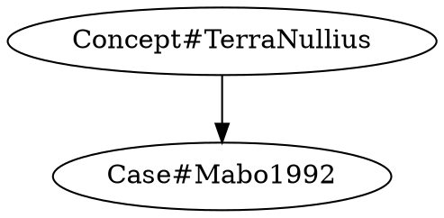

# SensibLaw

[](https://github.com/SensibLaw/SensibLaw/actions/workflows/ci.yml)

Like coleslaw, it just makes sense.

## Installation

Install the package in editable mode to develop locally:

```bash
pip install -e .
```

## CLI

Retrieve a document revision as it existed on a given date:

```bash
sensiblaw get --id 1 --as-at 2023-01-01
```

See [docs/versioning.md](docs/versioning.md) for details on the versioned
storage layer and available provenance metadata.

## CLI Commands

### Match Concepts

Identifies legal concepts in free text based on pattern triggers.

*Required files*: `triggers.json` containing concept patterns.

```bash
sensiblaw concepts match --patterns-file triggers.json --text "permanent stay"
```

Sample output:

```json
[
  "Concept#StayOfProceedings"
]
```

### Explore Graph Subgraphs

Generates a DOT-format subgraph around seed nodes within the knowledge graph.

*Required files*: pre-built graph data (e.g., ontology and case sources under `data/`).

```bash
sensiblaw graph subgraph --seeds Concept#TerraNullius Case#Mabo1992 --hops 2 --dot
```

Sample output:



### Run Story Tests

Executes scenario tests against a narrative story to verify expected outcomes.

*Required files*: `s4AA.json` containing test definitions and `story.json` with the scenario data.

```bash
sensiblaw tests run --tests-file s4AA.json --story-file story.json
```

Sample output:

```text
3 passed, 0 failed
```
