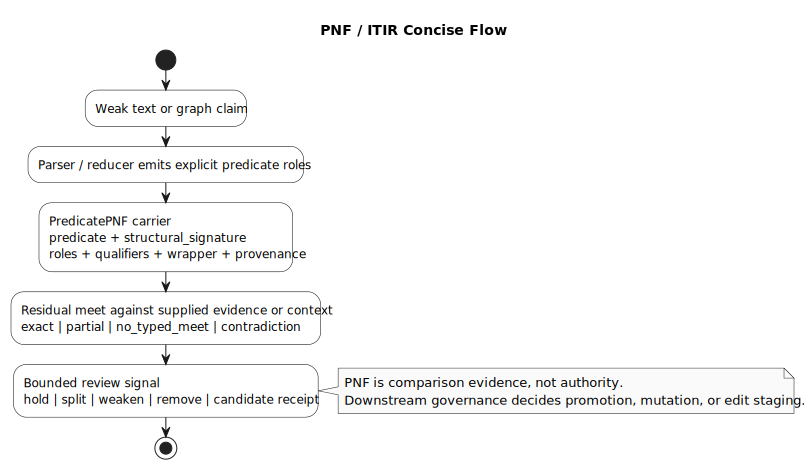

# PNF / ITIR Typed Predicate Carrier Primer

This note is the canonical public primer for Predicate Normal Form (PNF) as it
is used in the current ITIR / SensibLaw implementation.

PNF is not a separate reasoning oracle. It is the typed predicate carrier that
lets ITIR turn messy source material into explicit, comparable, provenance
bearing structures. Downstream lanes can then compare those structures, preserve
residual uncertainty, and emit bounded review or read-model artifacts without
pretending that the carrier itself is truth authority.

The implementation anchor is `src/text/residual_lattice.py`.

## What PNF Is

PNF is the normal form for a typed predicate envelope. A carrier names the
predicate being considered, binds typed arguments into named roles, records
qualifiers and wrapper state, and keeps provenance attached to the structure
being compared.

In the current implementation, a `PredicatePNF` contains:

- `predicate`: the predicate key or relation being represented
- `structural_signature`: the comparison fibre for structurally similar atoms
- `roles`: named role slots bound to `TypedArg` values
- `qualifiers`: polarity, modality, tense, certainty, condition, temporal
  scope, and jurisdiction scope
- `wrapper`: wrapper status plus an `evidence_only` flag
- `modifiers`: additional explicit payload emitted by upstream reducers
- `provenance`: source anchors carried into comparison results
- `atom_id`: optional stable atom identifier
- `domain`: optional domain fence for direct comparability

`PredicateAtom` is the compatibility subtype used by bounded residual
comparison. Mapping payloads can also be coerced into `PredicateAtom` when they
carry enough explicit predicate and role structure.

## Why It Exists

PNF gives ITIR a middle layer between raw text and governed artifacts.

Raw text, labels, headings, UI furniture, parser fragments, or model summaries
are not enough authority to promote facts, tasks, edits, or workflow state by
themselves. PNF gives the system a deterministic structure that can be compared
while preserving what remains unresolved.

The intended flow is:

```text
source material -> parser/reducer output -> PredicatePNF carrier
  -> residual comparison -> bounded review/read-model artifact
```

Concise diagram:



```text
weak text or graph claim
  -> parser / reducer emits explicit predicate roles
  -> PredicatePNF carrier
       predicate + structural_signature
       roles + qualifiers + wrapper + provenance
  -> residual meet against supplied evidence or context
       exact | partial | no_typed_meet | contradiction
  -> bounded review signal
       hold | split | weaken | remove | candidate receipt
```

This lets lanes ask narrower questions:

- does this candidate have the same structural signature as known evidence?
- which role bindings are shared?
- which expected roles are missing?
- did a role value or polarity contradict the comparison target?
- what provenance supports the comparison?

## Residual Lattice

The residual lattice is the comparison surface for explicit PNF carriers. It is
implemented in `src/text/residual_lattice.py`.

Residual levels are ordered by severity:

```text
exact < partial < no_typed_meet < contradiction
```

- `exact`: the comparable carrier has all requested role bindings without
  contradiction.
- `partial`: the carriers are comparable, but at least one requested role is
  missing.
- `no_typed_meet`: the carriers are not directly comparable inside the current
  bounded set.
- `contradiction`: a role binding, entity type, value, or polarity conflicts.

The residual result is evidence for downstream routing. It is not a declaration
that a claim is globally true or false.

Direct comparability currently requires:

- both payloads can be coerced into predicate atoms
- matching `structural_signature`
- matching `domain` when both sides provide one
- at least one shared role slot

Role values are joined slotwise. Variable or unresolved bindings may refine to
bound values, multi-cardinality roles may join compatible occupants, and
conflicting single-cardinality values become contradictions.

## Where PNF Appears Today

PNF is already used as a shared structural pattern across several public
SensibLaw surfaces:

- fact intake probes compare supplied `PredicatePNF` atoms and receipt-backed
  evidence rows
- Wikidata review packets may carry review-only grounding from supplied
  predicate carriers to supplied Wikidata candidates
- semantic-memory helpers consume supplied atoms, grounding rows, and ontology
  closure paths for private retrieval records
- StatiBaker task-memory helpers use `TaskPNF` plus `ProjectContextPNFIndex` as
  a project-context meet, not as raw keyword tasking
- shared reducer interfaces expose `PredicatePNF` for downstream adapter
  boundaries

These lanes use PNF differently, but the boundary is the same: explicit typed
carriers and receipts first, promotion or mutation only through a downstream
governance layer.

## Authority Boundaries

PNF carriers are comparison evidence. They are not authority by themselves.

PNF does not:

- parse raw text by itself
- call a model
- fabricate receipts
- fabricate Wikidata QIDs or PIDs
- grant live Wikidata edit authority
- mutate StatiBaker or mark work complete
- promote facts, tasks, edits, or workflow state without downstream receipts
- define evaluation scoring, model judgment payloads, prompt suites, or query
  suites

Parser output, dependency frames, headings, labels, wrapper text, and raw
keywords may contribute evidence to a PNF carrier, but they are not promotion
authority.

## Worked Fact Example

A source row says that Ada signed Contract A on 2026-05-20. An upstream reducer
may emit a supplied PNF carrier:

```json
{
  "atom_id": "fact:signature:1",
  "predicate": "signed",
  "structural_signature": "signature_event",
  "roles": {
    "actor": {"value": "Ada", "entity_type": "person"},
    "object": {"value": "Contract A", "entity_type": "document"},
    "date": {"value": "2026-05-20", "entity_type": "date"}
  },
  "qualifiers": {"polarity": "positive"},
  "wrapper": {"evidence_only": true},
  "provenance": ["source:row:17"]
}
```

A query carrier asking whether Ada signed Contract A can meet this evidence
exactly. A query that also requires a location may meet it partially because the
location role is missing. A carrier saying Ada did not sign Contract A conflicts
through polarity. A carrier with a different structural signature, such as a
payment event, has no typed meet.

## Worked Wikidata Review Example

A bounded review packet may ask whether a supplied Wikidata candidate should
weaken an over-specific relation. The runtime must first supply the predicate
carrier and candidate grounding; the carrier does not invent QIDs, PIDs, or edit
authority.

A simplified PNF carrier might bind:

```json
{
  "atom_id": "review:predicate:1",
  "predicate": "has_superclass",
  "structural_signature": "WikidataSubclassClaimPNF",
  "domain": "wikidata_review",
  "roles": {
    "item": {"value": "Q-example-local", "entity_type": "wikidata_item"},
    "candidate_superclass": {
      "value": "Q-supplied-broader-class",
      "entity_type": "wikidata_item"
    }
  },
  "qualifiers": {"polarity": "positive"},
  "wrapper": {"status": "review_candidate", "evidence_only": true},
  "provenance": ["review_packet:row:4"]
}
```

The Wikidata review lane can compare that carrier with supplied graph,
constraint, and corpus evidence. An exact or partial meet may support a bounded
review disposition such as hold, weaken, split, or remove. A contradiction may
block the candidate. No typed meet may abstain. In all cases, the output remains
a review signal; it is not a live Wikidata edit, a fabricated identifier, or a
PNF receipt created from label inspection.

## Implementation Map

Primary implementation:

- `src/text/residual_lattice.py`: `PredicatePNF`, `PredicateAtom`,
  `TypedArg`, `QualifierState`, `WrapperState`, `Residual`, `ResidualLevel`,
  `comparable(...)`, `meet_atom(...)`, `compute_residual(...)`, and
  `build_predicate_index(...)`

Current public usage surfaces:

- `src/fact_intake/fact_extraction_probe.py`
- `src/statibaker_kanban.py`
- `src/ontology/wikidata_change_review.py`
- `src/sensiblaw/interfaces/shared_reducer.py`

Supporting architecture notes:

- `docs/planning/pnf_itir_typed_predicate_integrated_20260506.puml`
- `docs/planning/pnf_itir_concise_flow_20260521.puml`
  (`.png` and `.svg` renderings are checked in beside it)
- `docs/planning/semantic_memory_bridge_future_lane_20260506.md`
- `docs/planning/wikidata_pnf_residual_review_example_20260429.md`
- `docs/planning/wikidata_temporal_pnf_constraint_contract_20260502.md`
